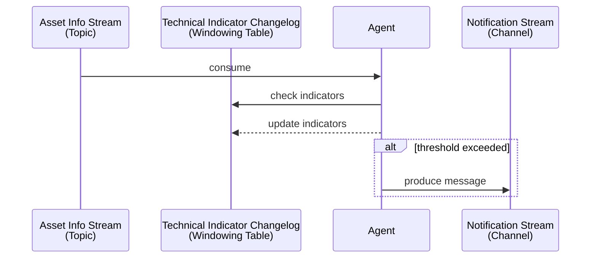
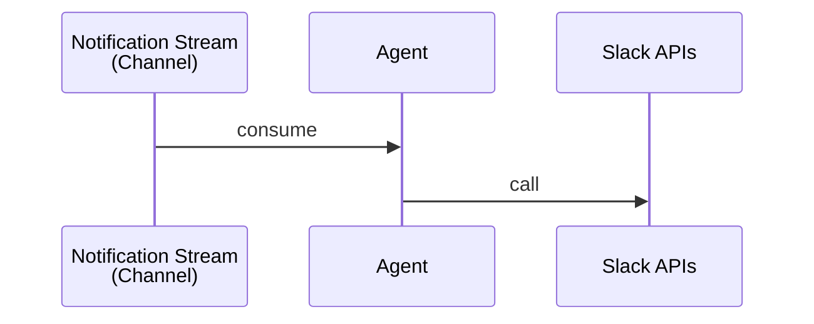

# Experiment Worker Python

## Description
This is a Python implementation of the `Worker` in the ***Experiment*** project.
Please visit the documentation repository for more information: [**experiment-document**](https://github.com/maxswu/experiment-document).

## Key Features
- Utilizes the [faust-streaming](https://github.com/faust-streaming/faust) library for stream-processing, an active community fork of the original [Faust](https://github.com/robinhood/faust) (by [Robinhood](https://robinhood.com/)).
- Use the popular [Pydantic](https://docs.pydantic.dev/) library for reliable data validation.
- Leverages [python-slack-sdk](https://github.com/slackapi/python-slack-sdk) for sending notifications.

## Installation
```commandline
poetry install
```

## Usage

> Ensure you have a properly configured `.env` file or have exported the necessary environment variables.
> See [`.env.sample`](.env.sample) for more information.

### Start the `Faust` app worker

```commandline
python -m worker worker -l info
```

or

```commandline
docker compose up
```

> This application is built using [faust-streaming](https://github.com/faust-streaming/faust). For more usage detail, please refer to [Faust Stream's Documentation](https://faust-streaming.github.io/faust/index.html).

## Code Structure
```text
.
└── worker
    ├── __main__.py  # Entry point
    ├── app.py  # Faust apps
    ├── market_info  # Market info streams
    │   ├── agent.py
    │   └── model.py
    └── notification  # Market info streams
        ├── agent.py
        ├── config.py
        ├── exception.py
        └── service.py
```

## Stream Processors

### 1. Send notifications based on user-defined technical indicators from the asset info stream.


### 2. Send messages via Slack from the notification stream.


## TODOs
- [ ] Add more tests.
- [ ] CI / CD.
- [ ] Integration with the Shared Cache Service.
